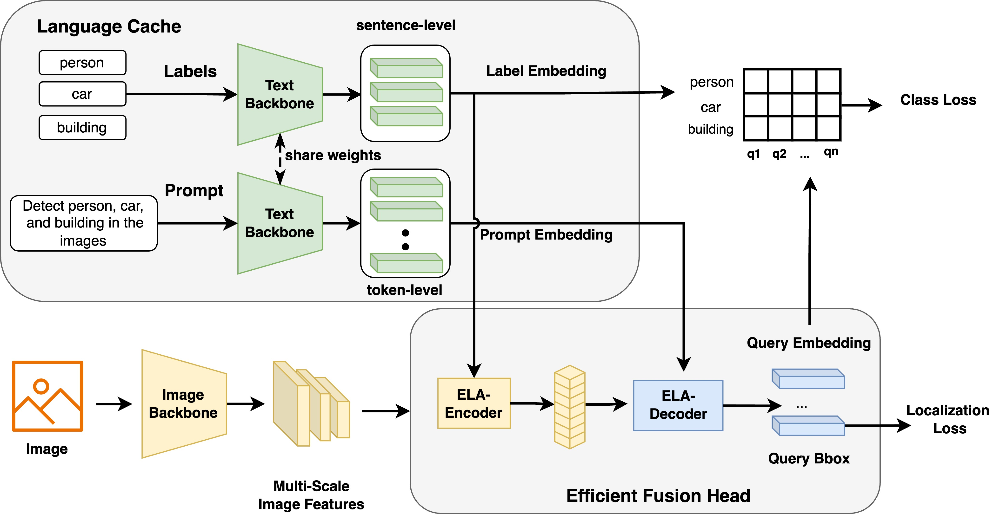

#  OmModel  

<a href="README.md">English</a> | <a href="README_ZH.md">中文</a>

A collection of strong multimodal models for building the best multimodal agents

---

## 🗓️ Updates
* **07/04/2024**: [OmAgent](https://github.com/om-ai-lab/OmAgent) is now open-sourced. 🌟 Dive into our Multi-modal Agent Framework for complex video understanding. Read more in our [paper](https://arxiv.org/abs/2406.16620).
* **06/09/2024**: [OmChat](https://github.com/om-ai-lab/OmChat) has been released. 🎉 Discover the capabilities of our multimodal language models, featuring robust video understanding and support for context up to 512k. More details in the [technical report]().
* **03/12/2024**: [OmDet](https://github.com/om-ai-lab/OmDet) is now open-sourced. 🚀 Experience our fast and accurate Open Vocabulary Detection (OVD) model, achieving 100 FPS. Learn more in our [paper](https://arxiv.org/abs/2209.05946).

---

## 🗃️ Projects

Here are the various projects we've worked on at OmLab:

### ⭐️ [OmAgent](https://github.com/om-ai-lab/OmAgent)
**Multi-modal Agent Framework for Complex Video Understanding with Task Divide-and-Conquer**

### ⭐️ [OmDet](https://github.com/om-ai-lab/OmDet)
**Fast and accurate open-vocabulary end-to-end object detection** 

### ⭐️ [OmChat](https://github.com/om-ai-lab/OmChat)
**Multimodal Language Models with Strong Long Context and Video Understanding**

### ⭐️ [OVDEval](https://github.com/om-ai-lab/OVDEval)
**A Comprehensive Evaluation Benchmark for Open-Vocabulary Detection**

---

## 📜 Papers

Here are the research papers published by OmLab:

### 🏷️ [How to Evaluate the Generalization of Detection? A Benchmark for Comprehensive Open-Vocabulary Detection](https://ojs.aaai.org/index.php/AAAI/article/view/28485/28945)
**Published in:** AAAI, 2024

### 🏷️ [OmDet: Large-scale vision-language multi-dataset pre-training with multimodal detection network](https://arxiv.org/abs/2209.05946)
**Published in:** IET Computer Vision, 2024  

### 🏷️ [Real-time Transformer-based Open-Vocabulary Detection with Efficient Fusion Head](https://arxiv.org/abs/2403.06892)
**Published in:** Arxiv. 2024  

### 🏷️ [OmAgent: A Multi-modal Agent Framework for Complex Video Understanding with Task Divide-and-Conquer](https://arxiv.org/abs/2406.16620)
**Published in:** Arxiv. 2024  

### 🏷️ [OmChat: A Recipe to Train Multimodal Language Models with Strong Long Context and Video Understanding]()
**Published in:** Arxiv. 2024 (Comming Soon)

### 🏷️ [Sparta: Efficient open-domain question answering via sparse transformer matching retrieval](https://arxiv.org/pdf/2009.13013)
**Published in:** NAACL, 2021

---

## 📬 Contact

For more information, feel free to reach out to us at [tianchez@hzlh.com](mailto:tianchez@hzlh.com).

---

Thank you for visiting OmModel's repository. We hope you find our projects and papers insightful and useful!
