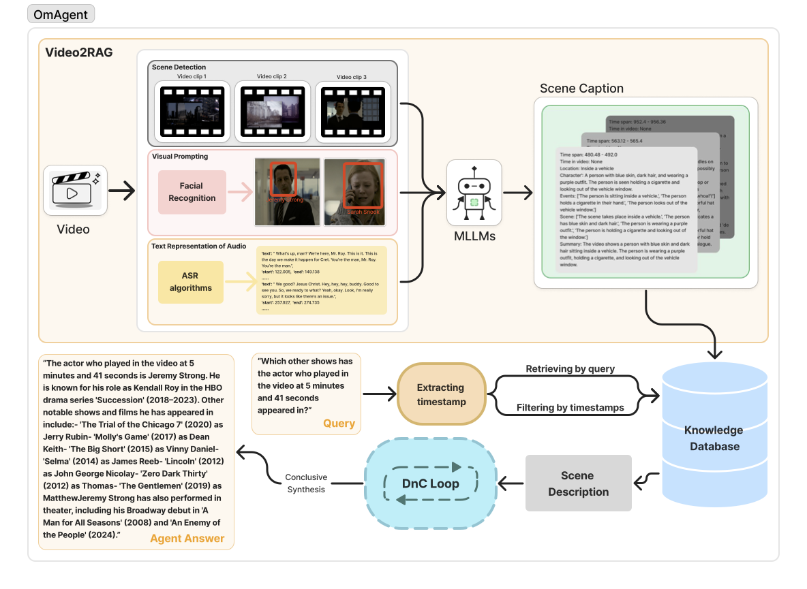
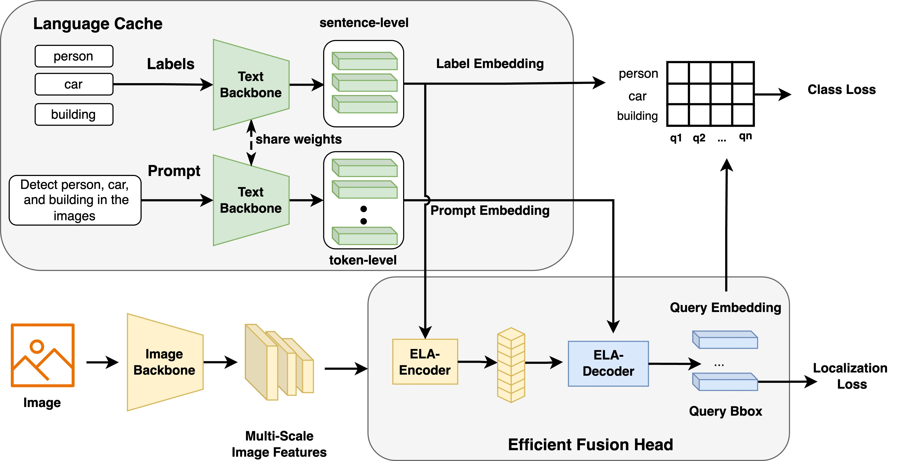
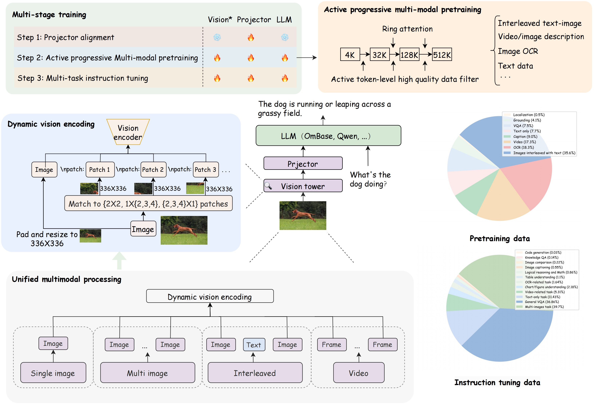
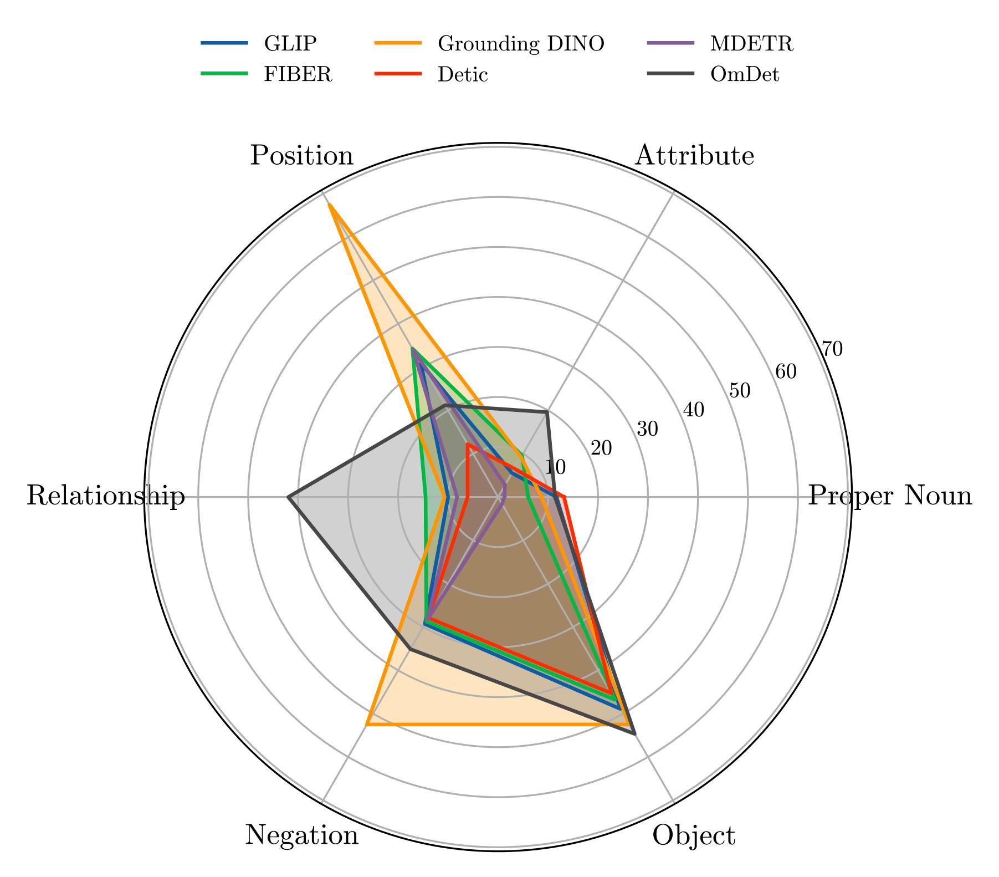

# OmModel  

<a href="README.md">English</a> | <a href="README_ZH.md">中文</a>

一个强大的多模态模型和项目集合，探索最强的多模态智能体。

---

## 🗓️ 最新进展
* **07/04/2024**: [OmAgent](https://github.com/om-ai-lab/OmAgent) 现已开源。🌟 探索我们的复杂视频理解多模态智能体框架。阅读我们的[论文](https://arxiv.org/abs/2406.16620)了解更多。
* **06/09/2024**: [OmChat](https://github.com/om-ai-lab/OmChat) 已发布。🎉 尝试我们多模态大语言模型的强大功能，具备视频理解并支持长达512k的上下文。更多详情请见[技术报告]()。
* **03/12/2024**: [OmDet](https://github.com/om-ai-lab/OmDet) 现已开源。🚀 体验我们快速且准确的开放词表多模态目标检测（OVD）模型，最快推理速度可达到100 FPS。欲了解更多请阅读我们的[论文](https://arxiv.org/abs/2209.05946)。

---

## 🗃️ 开源项目

### ⭐️ [OmAgent](https://github.com/om-ai-lab/OmAgent)
**基于Task Divide-and-Conquer的复杂视频理解多模态智能体框架**

### ⭐️ [OmDet](https://github.com/om-ai-lab/OmDet)
**快速且准确的开放词表端到端多模态目标检测模型** 

### ⭐️ [OmChat](https://github.com/om-ai-lab/OmChat)
**具有超长上下文和强大视频理解能力的多模态大语言模型**

### ⭐️ [OVDEval](https://github.com/om-ai-lab/OVDEval)
**一个开放词表目标检测模型的综合评估基准数据集**

---

## 📜 论文以及技术报告

### 🏷️ [How to Evaluate the Generalization of Detection? A Benchmark for Comprehensive Open-Vocabulary Detection](https://ojs.aaai.org/index.php/AAAI/article/view/28485/28945)
**发表于:** AAAI, 2024

### 🏷️ [OmDet: Large-scale vision-language multi-dataset pre-training with multimodal detection network](https://arxiv.org/abs/2209.05946)
**发表于:** IET Computer Vision, 2024  

### 🏷️ [Real-time Transformer-based Open-Vocabulary Detection with Efficient Fusion Head](https://arxiv.org/abs/2403.06892)
**发表于:** Arxiv. 2024  

### 🏷️ [OmAgent: A Multi-modal Agent Framework for Complex Video Understanding with Task Divide-and-Conquer](https://arxiv.org/abs/2406.16620)
**发表于:** Arxiv. 2024  

### 🏷️ [OmChat: A Recipe to Train Multimodal Language Models with Strong Long Context and Video Understanding]()
**发表于:** Arxiv. 2024 (即将发布)

### 🏷️ [Sparta: Efficient open-domain question answering via sparse transformer matching retrieval](https://arxiv.org/pdf/2009.13013)
**发表于:** NAACL, 2021

---

## 📬 联系方式

如需更多信息，请随时通过[tianchez@hzlh.com](mailto:tianchez@hzlh.com)联系我们。

---

感谢您访问OmModel的仓库。希望我们的项目和论文对您有所启发和帮助！
